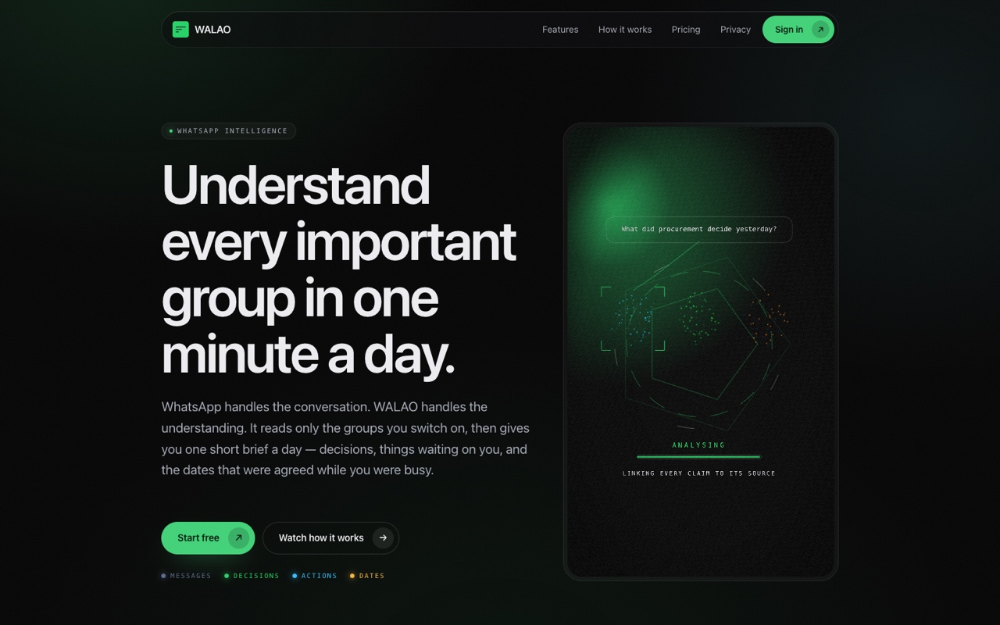
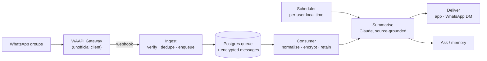

<div align="center">



<h1>WALAO</h1>

**WhatsApp handles the conversation. WALAO handles the understanding.**

One short daily brief from the WhatsApp groups you switch on — decisions, things
waiting on you, and the dates that were agreed while you were busy. Every claim
links back to the message it came from.

*WhatsApp 负责聊天，WALAO 负责理解。每天一分钟，看懂所有重要群组。*

[**walao.app**](https://walao.app) · [How it works](https://walao.app/how) · [Pricing](https://walao.app/pricing) · [Privacy](https://walao.app/security) · [Product spec](docs/product-spec.md)

<br>


</div>

---

> [!IMPORTANT]
> WALAO reads WhatsApp through the unofficial [WAAPI Gateway](https://github.com/mecaca-global-inc/waapi-gateway).
> An unofficial WhatsApp client may violate WhatsApp's Terms of Service and can get an account suspended.
> Do not pair a primary phone number or real customer data before your own legal, privacy and platform-risk review.
>
> WALAO 通过非官方的 WAAPI Gateway 接入 WhatsApp。非官方 client 可能违反 WhatsApp 服务条款并导致账号停用。
> 在完成法律、隐私与平台风险评估前，请勿配对主要号码或真实客户资料。

## What it does

| | |
|---|---|
| **Opt-in per group** | Nothing is read until you switch a group on. Zero groups are enabled by default. |
| **One brief a day** | Delivered at a local time you choose, to the app or a private WhatsApp chat. |
| **Sourced, not guessed** | Every decision, action and date carries a link to the message behind it. "I don't know" beats a plausible invention. |
| **Ask across your groups** | Questions answered only from data you approved, with sources attached. |
| **Deletable by design** | Per-group retention, envelope encryption per account, export and delete built in — not bolted on. |

## How it works



Everything durable lives in PostgreSQL — queue, encrypted message bodies, schedules,
summaries and their source rows. No broker, no vector database, no ORM.

## Running it locally

Node 24+ and a PostgreSQL. There is no build step — Node runs the TypeScript sources directly.

```bash
npm install
cp .env.example .env          # DATABASE_URL and WALAO_ENC_KEY at minimum
npm run dev                   # http://localhost:3000
```

### Tests

The suite truncates every table it touches, so it refuses to run against any database
whose name does not end in `_test` (`test/helpers.ts`). Creating that database is the
one-time step — nothing does it for you:

```bash
createdb walao_test
# or, against the docker-compose Postgres:
docker compose exec postgres createdb -U walao walao_test
```

Then, every time:

```bash
npm run typecheck
DATABASE_URL=postgres://localhost:5432/walao_test npm test
```

Migrations are applied by the harness on first connection, so a fresh `walao_test`
needs no further setup.

## Repository layout

| Path | What lives there |
|---|---|
| `src/` | Server, API, ingest, consumer, scheduler, summariser, privacy, billing |
| `public/` | Marketing site and the product UI (static, CSP-strict, no bundler) |
| `migrations/` | Numbered SQL migrations, applied in order at startup |
| `test/` | `node --test` suites, run serially against a `*_test` database |
| `docs/` | [Product spec](docs/product-spec.md), [ADRs](docs/adr), version specs |

## Design decisions

- [ADR 0001 — one shared gateway, many sessions](docs/adr/0001-shared-gateway-many-sessions.md)
- [ADR 0002 — per-account envelope encryption](docs/adr/0002-per-account-envelope-encryption.md)
- [ADR 0003 — Singapore data residency](docs/adr/0003-singapore-residency.md)

Full product specification, data model, API draft, privacy posture and gateway
capability verification (bilingual, EN/中文): **[docs/product-spec.md](docs/product-spec.md)**.

## Licence and trademark

This repository does not grant rights to the WhatsApp name or platform. WhatsApp is a
trademark of its respective owner. WAAPI Gateway is a separate, unofficial MIT-licensed
project — review its licence, notices and upstream dependency terms before use.

本仓库不授予任何 WhatsApp 名称或平台权利。WhatsApp 是其权利人的商标。
