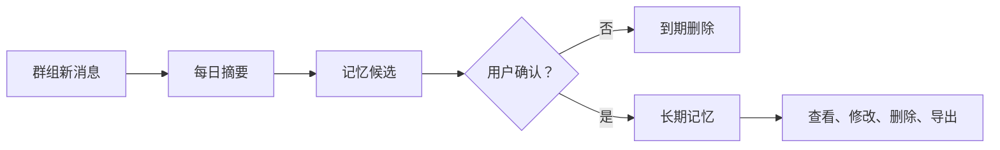
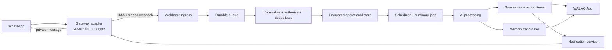

# WALAO

> WhatsApp AI Life Assistant and Organizer  
> WhatsApp AI 生活助理与信息整理助手

**WALAO helps people understand what matters across busy WhatsApp groups—without reading every message.**  
**WALAO 帮助用户从繁忙的 WhatsApp 群组中抓住重点，不必逐条翻阅讯息。**

[中文](#中文) · [English](#english) · [Gateway verification](#gateway-capability-verification--gateway-能力核实)

> [!IMPORTANT]
> WALAO is currently a product specification and prototype plan, not a released service. The proposed prototype uses the unofficial [WAAPI Gateway](https://github.com/mecaca-global-inc/waapi-gateway). An unofficial WhatsApp client may violate WhatsApp's Terms of Service and may lead to account suspension. Do not use a primary phone number or production customer data until legal, privacy, security, and platform-risk reviews are complete.
>
> WALAO 目前是一份产品规格与原型计划，并非已经上线的服务。原型拟采用非官方的 [WAAPI Gateway](https://github.com/mecaca-global-inc/waapi-gateway)。非官方 WhatsApp client 可能违反 WhatsApp 服务条款，并可能导致账号被停用。在完成法律、隐私、安全及平台风险评估前，请勿使用主要电话号码或真实客户资料。

---

# 中文

## 1. 产品概述

WhatsApp 负责聊天，WALAO 负责理解。

WALAO 是建立在 WhatsApp 之上的个人 AI 信息层。它接收用户明确选择的群组新消息，在指定时间生成简短摘要，提取决定、待办、日期与需要回复的事项，再通过 WALAO App 或 WhatsApp 私讯交付给用户本人。

WALAO 不取代 WhatsApp，也不鼓励用户改变原有聊天习惯。用户仍然在 WhatsApp 沟通；WALAO 只负责过滤噪音、整理上下文，并在用户需要时帮助检索。

### 一句话定位

**每天一分钟，看懂所有重要群组。**

### 暂定品牌释义

**W**hatsApp **A**I **L**ife **A**ssistant and **O**rganizer

`WALAO` 是品牌名称；上述英文全称为暂定解释，不影响品牌独立使用。

## 2. 用户问题

WhatsApp 群组每天产生大量消息，但用户真正需要的通常只有几类：

- 今天做了什么决定？
- 哪些事情需要我回复或跟进？
- 有哪些日期、会议、付款或截止时间？
- 哪些内容很重要，但现在不需要处理？
- 以后要找某个决定时，能不能直接问，而不是重新翻几百条消息？

现有通知只告诉用户“有新消息”，没有告诉用户“哪一条值得花时间”。WALAO 的价值不是增加通知，而是减少阅读负担。

## 3. 目标用户

首批目标用户：

- 同时管理多个工作群组的中小企业老板
- 销售、客户成功与业务发展人员
- 项目经理、营运与行政团队
- 社群、活动或委员会负责人
- 经常错过群组决定、待办与重要日期的知识工作者

早期内测优先选择拥有 3–10 个高频工作群组、愿意提供明确反馈，并可使用独立测试账号的用户。

## 4. 产品目标与边界

### 目标

- 每天为用户节省 30–60 分钟的信息整理时间（待实测验证）
- 降低错过决定、行动项和截止日期的机会
- 让跨群组信息可以被统一浏览和检索
- 让长期记忆由用户确认、查看、修改和删除
- 把 WhatsApp 接入层设计成可替换组件，避免核心产品被单一 Gateway 锁定

### MVP 不做

- 不做群发营销、冷启动推广或垃圾消息工具
- 不自动代表用户回复群组
- 不承诺导入连接前的历史消息
- 不在 MVP 理解图片、语音、影片或文件内容
- 不自动把所有聊天内容写入长期记忆
- 不以“Zero Knowledge”作为 MVP 宣称
- 不承诺 WAAPI Gateway 等同于 Meta 官方 WhatsApp Business Platform

## 5. 核心产品原则

1. **少而重要**：摘要先讲决定、行动和风险，不复述整天聊天。
2. **证据可追溯**：每个摘要项目保留来源群组、时间和消息引用。
3. **用户确认后才记住**：长期记忆先成为候选，再由用户确认。
4. **默认少保存**：原始消息有明确保存期限，过期自动删除。
5. **消息是不可信资料**：群组文字不能改变系统规则，也不能触发外部操作。
6. **WhatsApp 是执行层，WALAO 是智能层**：复杂浏览在 App，快速问答与提醒可在 WhatsApp 内完成。
7. **Gateway 可替换**：WALAO 的摘要、记忆、权限与体验不能依赖某个特定 Gateway 的内部数据结构。

## 6. 用户体验

### 首次设置

1. 用户创建 WALAO 账号。
2. 阅读资料用途、保存期限、第三方 AI 处理及非官方 Gateway 风险说明。
3. 使用独立测试号码连接 WhatsApp，或将专用 WALAO 测试号码加入获准的群组。
4. 选择允许处理的群组；默认不处理其他群组。
5. 选择摘要时间、时区、语言、交付渠道与资料保存期限。
6. 完成测试摘要并确认设置。

### 每日使用

1. WALAO 只接收已启用群组的新消息。
2. 到达排程时间后，系统按群组生成摘要，再整理成 Today Brief。
3. 用户在 App 或 WhatsApp 私讯收到重点。
4. 用户可查看来源、标记完成、忽略事项，或跳回 WhatsApp 处理。
5. 用户可以问：“昨天采购群决定了什么？”系统只根据获准且仍在保存期限内的资料回答。

### Today Brief

```text
早安，今天有 5 件事值得你看

需要你处理（2）
1. 确认周五 3:00 PM 的供应商会议     [采购群]
2. 回复最终报价是否获批               [Sales MY]

已决定（2）
• 包装改用 B 方案                     [产品群]
• 发布日期移到 8 月 12 日             [Launch]

留意（1）
• 客户反馈登录流程太长                 [Support]

[查看来源] [标记完成] [打开 WhatsApp]
```

底部导航：`Today` · `Groups` · `Ask` · `Memory` · `Settings`

## 7. 功能范围

### MVP：必须完成

| 功能 | 行为 | 验收标准 |
|---|---|---|
| 群组选择 | 用户逐个启用或停用群组 | 未启用群组的消息不会进入 WALAO 处理层 |
| 自订摘要 | 每个群组可设时间、时区、语言和开关 | 排程在用户时区正确执行 |
| 每日群组摘要 | 输出重点、决定、行动项、日期和未解决问题 | 每一项均有来源引用；无内容时不硬凑摘要 |
| Today Brief | 合并多个群组的重要事项并排序 | 重复事项会合并，来源仍可查看 |
| 私人交付 | App 内通知；可选 WhatsApp 私讯 | 不把个人摘要发回原群组 |
| 基础提醒 | 用户确认后建立提醒 | 系统不会仅凭群组文字直接执行外部操作 |
| 隐私控制 | 查看、删除、导出、暂停处理 | 操作有审计记录并可验证完成 |
| 连接健康 | 显示在线、断线、需重新配对 | 断线时不假装摘要完整 |

### 下一阶段

- **Ask WALAO**：对获准资料进行自然语言问答，并附消息来源
- **AI Inbox**：跨群组排列“需要处理、已决定、仅供参考”
- **行动中心**：追踪负责人、截止日期和完成状态
- **日历连接**：只在用户确认后新增日历事项
- **每周回顾**：本周决定、未完成事项和反复出现的风险
- **语音摘要**：将已生成的文字摘要转为音频，而非直接保存所有群组语音

### 长期方向

- 用户确认的长期记忆
- 跨群组情境理解
- 关系与跟进提醒
- 团队共享摘要及企业管理后台
- 官方 WhatsApp 接入选项（能力与群组场景需另行验证）

## 8. 长期记忆设计

长期记忆不是“永久保存全部聊天”。它是一个受控流程：



记忆候选示例：

- “供应商 A 的标准付款期限是 30 天。”
- “项目 Alpha 的最终负责人是 Mei。”
- “团队已决定使用包装方案 B。”

每条长期记忆至少包含：内容、来源、建立时间、确认者、最后使用时间和删除状态。敏感资料不得仅因模型判断而自动永久保存。

> **关于 Zero Knowledge**：服务器端 LLM 需要读取内容才能生成摘要，因此普通云端 MVP 不能诚实地宣称 Zero Knowledge。只有在端侧处理、用户持有密钥且服务端无法解密，或经过独立验证的 confidential-computing 架构下，才应重新评估此定位。

## 9. 系统架构



### 服务职责

- **Gateway adapter**：把 WAAPI 的 session、JID、Webhook 与发送 API 转换成 WALAO 内部格式。
- **Webhook ingress**：验证签名、限制大小、检查时间、去重，并尽快返回成功。
- **Durable queue**：吸收尖峰并允许重试，避免 AI 处理阻塞消息接收。
- **Normalizer**：识别用户、群组、发送者、文字、时间与消息方向。
- **Scheduler**：按用户时区产生摘要任务。
- **AI processing**：摘要、分类、行动项与记忆候选；不能根据聊天内容调用工具。
- **Notification service**：向 App 或用户私人 WhatsApp 对话交付结果。
- **Privacy service**：执行保存期限、删除、导出、授权和审计。

### 最小部署建议

- WALAO 主资料库先使用 PostgreSQL。
- MVP 不必先建独立向量资料库；先用 PostgreSQL 全文检索与结构化记忆。
- 只有当真实问答测试证明语义检索不足时，再加入 `pgvector`。
- Gateway 与 WALAO API 置于私有网络；对外只开放必要入口。
- 密钥放在云端 KMS 或 secrets manager，不写入源码或日志。

## 10. 最小资料模型

| 实体 | 关键字段 | 说明 |
|---|---|---|
| `users` | `id`, `timezone`, `language`, `status` | WALAO 用户 |
| `whatsapp_sessions` | `id`, `user_id`, `provider`, `external_session_id`, `status` | 不保存明文 API key |
| `groups` | `id`, `session_id`, `external_jid`, `name` | 外部 JID 需租户内唯一 |
| `group_subscriptions` | `user_id`, `group_id`, `enabled`, `retention_days` | 明确选择及保存政策 |
| `messages` | `external_id`, `group_id`, `sender_ref`, `sent_at`, `body_ciphertext` | 原文加密并自动过期 |
| `summary_schedules` | `user_id`, `local_time`, `timezone`, `channel` | 避免只存 UTC 时间 |
| `summaries` | `period_start`, `period_end`, `content`, `status` | 保存生成版本与模型资料 |
| `summary_sources` | `summary_id`, `message_id` | 支持追溯与删除传播 |
| `action_items` | `summary_id`, `text`, `owner`, `due_at`, `status` | 用户确认后才能触发提醒 |
| `memory_candidates` | `user_id`, `text`, `source_id`, `expires_at` | 未确认会过期 |
| `memories` | `user_id`, `text`, `source_id`, `confirmed_at` | 可修改、删除和导出 |
| `consent_records` | `scope`, `subject`, `version`, `recorded_at` | 记录授权依据和版本 |
| `audit_events` | `actor`, `action`, `target`, `created_at` | 不记录消息正文 |

所有查询都必须同时受 `user_id`/tenant scope 限制。对象储存、缓存、向量索引和备份也必须遵守同一隔离及删除规则。

## 11. AI 处理流程

1. 只读取用户启用群组及摘要时间窗内的消息。
2. 排除 `from_me` 的系统回送消息，避免循环。
3. 去重并按时间排序；保留发送者和消息引用。
4. 将群组消息视为不可信资料，隔离其中的 prompt injection。
5. 先抽取事实，再生成摘要；不确定时标记“不确定”。
6. 产生结构化输出：`highlights`、`decisions`、`action_items`、`dates`、`open_questions`、`memory_candidates`。
7. 验证每一项是否至少有一个有效来源。
8. 根据优先级生成用户可读版本。
9. 记录模型、提示词版本、token 用量和生成时间，但不在普通日志记录原始消息。

### 摘要输出契约

```json
{
  "highlights": [{"text": "...", "source_message_ids": ["..."]}],
  "decisions": [{"text": "...", "source_message_ids": ["..."]}],
  "action_items": [
    {
      "text": "...",
      "owner": null,
      "due_at": null,
      "confidence": 0.0,
      "source_message_ids": ["..."]
    }
  ],
  "dates": [],
  "open_questions": [],
  "memory_candidates": []
}
```

模型找不到答案时必须直接说不知道。它不能补写未出现的人名、日期、负责人或决定。

## 12. WALAO API 草案

| 方法 | 路径 | 用途 |
|---|---|---|
| `POST` | `/v1/connections` | 建立 Gateway 连接 |
| `GET` | `/v1/connections/{id}/status` | 查看连接健康与配对状态 |
| `GET` | `/v1/groups` | 列出可选择群组 |
| `PUT` | `/v1/groups/{id}/subscription` | 启用、停用和设置保存期限 |
| `GET/PUT` | `/v1/summary-schedule` | 查询或修改摘要时间 |
| `GET` | `/v1/briefs/today` | 取得 Today Brief |
| `GET` | `/v1/summaries/{id}` | 查看摘要与来源 |
| `POST` | `/v1/ask` | 根据授权资料问答 |
| `GET/POST/DELETE` | `/v1/memories` | 查看、确认或删除长期记忆 |
| `POST` | `/v1/privacy/export` | 建立资料导出 |
| `POST` | `/v1/privacy/delete` | 删除账号或指定群组资料 |

所有写入 API 需要认证、授权、输入验证、幂等处理和审计。对外部 Gateway 的调用不得直接暴露给 App。

## 13. 隐私与安全

### Privacy by Design

- **明确范围**：用户逐个选择群组，不默认全开。
- **透明告知**：说明读取内容、AI provider、保存期限、交付渠道和退出方式。
- **群组治理**：在启用前确认群组管理员许可，并采用适用于当地法律和场景的参与者告知/同意机制。
- **资料最小化**：MVP 只处理文字和必要 metadata。
- **传输与静态加密**：TLS、资料库/磁碟加密，以及敏感字段的应用层加密。
- **租户隔离**：每条资料带 tenant scope；后台任务也使用相同授权检查。
- **保存期限**：原始消息建议默认 7 天，由用户在允许范围内调整；摘要与已确认记忆采用独立期限。
- **删除传播**：删除必须覆盖主库、对象储存、缓存、索引和可控备份周期。
- **用户控制**：暂停、导出、删除群组资料、删除记忆、解除 WhatsApp 连接。
- **供应商控制**：选择不使用客户资料训练模型的 AI 服务条款，记录资料区域和 subprocessors。
- **管理员控制**：最小权限、MFA、审批、审计及敏感内容遮罩。

### 主要威胁与缓解

| 威胁 | 缓解措施 |
|---|---|
| 伪造 Webhook | 强制 HMAC、常数时间比较、时间窗、事件去重 |
| Webhook 重播 | 以 `session + message id` 做幂等键并限制时间窗 |
| 跨用户资料泄漏 | tenant scope、数据库政策、授权测试、每租户加密上下文 |
| Prompt injection | 把消息当资料而非指令；摘要模型无工具权限 |
| 员工滥用 | 最小权限、审批访问、审计、默认遮罩正文 |
| AI provider 留存 | 选择合适合约/区域/零留存选项，或自托管模型 |
| Gateway 掉线 | 健康监控、重新配对提示、摘要完整性标记 |
| Webhook 丢失 | WALAO 使用 durable ingress；监控序号/时间缺口并提示不完整 |
| WhatsApp 封号或协议变化 | 专用测试号码、速率限制、禁止 spam、Gateway adapter 可替换 |
| 资料删除不完整 | 删除工作流、索引/备份政策、定期验证 |

此文件不是法律意见。商业上线前应由合格顾问评估 WhatsApp 条款、马来西亚 PDPA 及所有目标市场的隐私、通讯和雇佣相关规定。

## 14. 成本控制

- 按“群组 × 时间窗”批次摘要，不逐条调用模型。
- 先做确定性清洗、去重和长度限制，再调用 AI。
- 小模型负责分类和抽取；只有复杂摘要才升级模型。
- 没有新消息就不运行任务。
- 重用群组摘要生成 Today Brief，不再次发送全部原文。
- 原文按期限删除；长期记忆只保存用户确认后的精炼事实。
- 先用 PostgreSQL，实际证明需要时才增加向量检索服务。
- 为每个方案设置可见的群组数、消息量和 AI 用量上限。

## 15. 商业模式假设

| 方案 | 假设范围 | 备注 |
|---|---|---|
| Free | 少量群组、每日一次基础摘要 | 用于验证使用习惯 |
| Pro | 更多群组、Ask WALAO、行动中心、已确认记忆 | 初步价格假设 RM19–RM39/月，需通过访谈测试 |
| Team | 团队共享、管理、审计、较长保存政策 | 价格另议；需先完成企业安全能力 |

定价是研究假设，不是已公布报价。

## 16. 成功指标

### 激活

- 完成连接并启用至少一个群组
- 24 小时内成功收到第一份摘要
- 首份摘要有来源可查看

### 使用

- 每周查看 Today Brief 的活跃天数
- 每位活跃用户连接的群组数
- 摘要项目的查看、完成、忽略和跳回 WhatsApp 比例
- Ask WALAO 的有来源回答率与“不知道”正确率

### 价值

- 用户自报每周节省时间
- 错过事项的自报下降
- 四周留存率
- 付费意愿与升级率

### 安全与可靠性

- 跨租户资料泄漏：0
- 未授权群组被处理：0
- 摘要完整率和延迟
- Gateway 断线时间与重连成功率
- 删除请求完成时间

## 17. 开发路线

### Sprint 0 — 可行性验证

- 使用独立测试号码完成 QR/配对登录
- 验证群组实时文字 Webhook、发送者、时间和群组 JID
- 验证私人文字消息发送
- 测试断线、重启、重新配对、消息尖峰和 Webhook 重试
- 完成 ToS、隐私与群组同意决策

**退出条件**：连续 7 天测试期间，新文字消息的可观测接收率达到团队设定门槛；所有已知缺口有明确显示，而不是静默遗漏。

### Sprint 1 — 消息接收与隔离

- Webhook HMAC 验证、幂等、durable queue
- 用户、session、群组和订阅映射
- 加密消息储存与自动过期
- 连接健康页面

### Sprint 2 — 每日摘要 MVP

- 排程、摘要 JSON 契约、来源引用
- 决定、行动项、日期和未解决问题
- WhatsApp 私讯交付与 App 内历史

### Sprint 3 — Today Brief App

- Today、Groups、Summary Settings、Privacy Settings
- 跳回 WhatsApp、标记完成、忽略
- 删除、导出和暂停处理

### Sprint 4 — Ask WALAO

- 有来源问答
- 权限过滤
- 不知道与低信心处理

### Sprint 5 — Memory Beta

- 记忆候选
- 用户确认、修改、删除和过期
- 每周回顾

## 18. 上线策略

1. 先做内部技术 spike，不碰真实客户资料。
2. 邀请 5–10 位内测用户，全部使用专用测试号码和获准群组。
3. 只开放文字摘要、App 查看和私人交付。
4. 每周人工审查摘要准确性、遗漏、错误行动项与隐私事件。
5. 通过可靠性、同意机制和付费意愿门槛后，再决定是否扩展。
6. 正式商业化前完成法律意见、事件响应、资料处理协议和 Gateway 替代计划。

## 19. 产品决策（2026-07-30 已确认）

1. **配对模式**：用户配对自己的 WhatsApp 账号。内测阶段按上线策略使用专用测试号码。
2. **群组同意**：按群组由用户自行声明负责（self-attestation），并提供一键可发的群内告知模板（建议但不强制）。声明事件记录存档。正式收费前，依法律意见升级更严格的同意流程。
3. **原始消息保存期**：用户可配置 1–30 天，默认 7 天；设置为全局（每用户一个），不按群组区分。摘要保存约 90 天；已确认记忆保留至用户删除。Ask WALAO 仅在原始保存期内引用原文，超出则基于摘要转述。
4. **交付渠道**：WhatsApp 优先——通过用户自己的“给自己发消息”私讯交付 Today Brief（Sprint 2）。App 作为历史、设置与 Ask WALAO 的界面（Sprint 3）。
5. **语言**：第一版输出支持中文、英文、马来文；输入自动处理混合语言。马来文摘要的每周人工审查：**由产品负责人临时担任审查人**，并将“至少 1 位以马来文为主的内测用户”列为招募条件，招到后移交审查职责。
6. **付费模型**：按 AI 用量计费，但以“点数（credits）”呈现（约 1 点 ≈ 1 次群组每日摘要）。按群组显示点数消耗，用户可关闭高消耗群组。永不向用户展示原始 token 数。
7. **Gateway 使用政策**（分级）：
   - **Tier 0（默认，全部用户）**：仅读取 + 给自己发消息。封号风险低。
   - **Tier 1（用户主动开通）**：向他人发送消息，需用户明确授权，风险由用户自行承担。首次向新号码发送后，对方需回复“Yes”才能继续。
   - **产品级停用条件**：收到 WhatsApp/Meta 法律通知即停用 Gateway。

### 已知残余风险（记录在案）

- Tier 1 的“Yes”握手首条消息属于冷发送（cold outbound），是账号上风险最高的行为；政策上由用户承担，预期会出现部分 Tier 1 封号。
- 无封号潮（ban wave）自动停用机制；若指纹检测导致多用户被封但无法律通知，需人工判断是否停用。
- 马来文审查暂由产品负责人兼任；在招到马来文为主的内测用户之前，审查深度有限。

---

# English

## 1. Product overview

WhatsApp handles the conversation. WALAO handles the understanding.

WALAO is a personal AI information layer for WhatsApp. It receives new messages from groups explicitly selected by the user, produces short summaries at scheduled times, extracts decisions, actions, dates, and replies that may be needed, then delivers the result through the WALAO app or a private WhatsApp message.

WALAO does not replace WhatsApp or ask users to change how they communicate. People continue chatting in WhatsApp. WALAO filters noise, organizes context, and helps retrieve information when needed.

### One-line positioning

**Understand every important group in one minute a day.**

### Working name expansion

**W**hatsApp **A**I **L**ife **A**ssistant and **O**rganizer

`WALAO` stands on its own as the brand. The expansion above is provisional.

## 2. The problem

Busy WhatsApp groups generate far more messages than useful outcomes. Users mainly need to know:

- What was decided today?
- What do I need to reply to or follow up on?
- Which meetings, payments, and deadlines were mentioned?
- What matters but does not require action now?
- Can I retrieve an old decision without scrolling through hundreds of messages?

Notifications say that something is new. They do not say whether it deserves attention. WALAO should reduce notifications and reading time, not add another noisy inbox.

## 3. Target users

Initial users:

- SME owners managing several work groups
- Sales, customer-success, and business-development teams
- Project managers, operations, and administrative teams
- Community, event, and committee organizers
- Knowledge workers who regularly miss decisions, tasks, or dates in group chats

The first closed beta should prioritize people with 3–10 active work groups, a willingness to give direct feedback, and access to a dedicated test number.

## 4. Goals and boundaries

### Goals

- Save users an estimated 30–60 minutes of information-processing time per day; validate this in research
- Reduce missed decisions, action items, and deadlines
- Provide one place to review and search across approved groups
- Keep long-term memory user-confirmed, visible, editable, and deletable
- Keep WhatsApp connectivity replaceable so the product is not locked to one gateway

### Not in the MVP

- Bulk marketing, cold outreach, or spam tooling
- Automatic replies sent on the user's behalf
- A promise to import messages sent before connection
- Understanding image, voice, video, or document contents
- Automatically placing all conversations into long-term memory
- A “zero knowledge” claim
- Any claim that WAAPI Gateway is equivalent to Meta's official WhatsApp Business Platform

## 5. Product principles

1. **Short and important**: lead with decisions, actions, and risks; do not replay the chat.
2. **Traceable evidence**: every summary item keeps its source group, timestamp, and message references.
3. **Remember only after confirmation**: long-term memories begin as candidates and require user approval.
4. **Store less by default**: raw messages have a clear retention period and expire automatically.
5. **Messages are untrusted data**: group text cannot override system rules or trigger external actions.
6. **WhatsApp is the execution layer; WALAO is the intelligence layer**: detailed review belongs in the app, while quick questions and reminders may live in WhatsApp.
7. **The gateway is replaceable**: summaries, memory, permissions, and user experience must not depend on a provider's internal schema.

## 6. User experience

### Onboarding

1. The user creates a WALAO account.
2. WALAO explains data use, retention, AI providers, and unofficial-gateway risk.
3. The user pairs a dedicated test number or adds a dedicated WALAO test number to approved groups.
4. The user selects the groups WALAO may process; every other group remains off.
5. The user chooses summary time, timezone, language, delivery channel, and retention period.
6. WALAO generates a test brief for confirmation.

### Daily flow

1. WALAO receives only new messages from enabled groups.
2. At the scheduled time, it summarizes each group and builds a combined Today Brief.
3. The user receives the brief in the app or by private WhatsApp message.
4. The user can inspect sources, complete or dismiss an item, and return to WhatsApp.
5. The user may ask, “What did the purchasing group decide yesterday?” WALAO answers only from approved data that remains within retention.

### Product surfaces

- **Today**: prioritized daily brief
- **Groups**: per-group summary, reminder, and retention controls
- **Ask**: source-grounded questions across approved groups
- **Memory**: candidates and user-confirmed long-term facts
- **Settings**: schedule, language, delivery, privacy, export, deletion, and connection health

## 7. Feature scope

### MVP

| Capability | Behaviour | Acceptance criterion |
|---|---|---|
| Group selection | Enable or disable groups individually | Messages from disabled groups never enter WALAO processing |
| Custom schedule | Set time, timezone, language, and per-group status | Jobs execute in the user's local timezone |
| Daily summaries | Extract highlights, decisions, actions, dates, and open questions | Every item has a source; quiet groups do not get invented content |
| Today Brief | Rank and combine information across groups | Duplicates are merged while sources remain visible |
| Private delivery | App notification and optional private WhatsApp message | A personal brief is never posted back to the source group |
| Basic reminders | Create reminders only after user confirmation | Group text alone cannot trigger an external action |
| Privacy controls | Pause, inspect, export, and delete | Actions are auditable and completion can be verified |
| Connection health | Show connected, disconnected, or re-pair required | WALAO never presents an incomplete brief as complete |

### Next

- **Ask WALAO** with source citations
- **AI Inbox** organized by needs-action, decided, and reference-only
- **Action Center** for owners, due dates, and status
- **Calendar connection** after explicit user confirmation
- **Weekly Review** for decisions, overdue items, and recurring risks
- **Audio briefs** generated from summaries rather than permanent storage of every voice note

### Later

- User-confirmed long-term memory
- Cross-group context
- Relationship and follow-up intelligence
- Shared team briefs and enterprise administration
- An official WhatsApp integration option, subject to a separate capability review for group use cases

## 8. Long-term memory

Long-term memory does not mean storing every conversation forever.

Messages create summaries. Summaries may produce memory candidates. Candidates expire unless the user confirms them. Confirmed memories remain visible, editable, exportable, and deletable.

Every memory should include its text, sources, creation time, confirmer, last-used time, and deletion status. Sensitive facts must never become permanent only because a model considered them useful.

> **About zero knowledge:** a server-side LLM must read content to summarize it, so a standard cloud MVP cannot honestly claim zero knowledge. Revisit that positioning only with client-side processing and user-held keys, or an independently validated confidential-computing design.

## 9. System design

The architecture diagram in the Chinese section is language-neutral. The responsibilities are:

- **Gateway adapter** converts provider-specific sessions, JIDs, webhooks, and send APIs into WALAO's internal format.
- **Webhook ingress** verifies signatures, enforces size and time limits, deduplicates events, and returns quickly.
- **Durable queue** absorbs bursts and makes processing retryable.
- **Normalizer** resolves user, group, sender, direction, text, and timestamps.
- **Scheduler** creates summary jobs in each user's timezone.
- **AI processing** summarizes, classifies, extracts actions, and proposes memories without tool access.
- **Notification service** delivers results through the app or a private WhatsApp chat.
- **Privacy service** enforces retention, deletion, export, consent, and audit policies.

### Minimum deployment

- Use PostgreSQL as WALAO's primary database.
- Start with PostgreSQL full-text search and structured memory; do not add a separate vector database yet.
- Add `pgvector` only when real question-answering tests show a semantic-retrieval gap.
- Keep the gateway and WALAO API on a private network and expose only required ingress.
- Store keys in a KMS or secrets manager, never in source code or ordinary logs.

## 10. Minimum data model

| Entity | Key fields | Purpose |
|---|---|---|
| `users` | `id`, `timezone`, `language`, `status` | WALAO users |
| `whatsapp_sessions` | `id`, `user_id`, `provider`, `external_session_id`, `status` | Never stores a plaintext API key |
| `groups` | `id`, `session_id`, `external_jid`, `name` | External JID is unique inside a tenant |
| `group_subscriptions` | `user_id`, `group_id`, `enabled`, `retention_days` | Explicit selection and retention policy |
| `messages` | `external_id`, `group_id`, `sender_ref`, `sent_at`, `body_ciphertext` | Encrypted raw text with automatic expiry |
| `summary_schedules` | `user_id`, `local_time`, `timezone`, `channel` | Store local scheduling intent, not UTC alone |
| `summaries` | `period_start`, `period_end`, `content`, `status` | Keeps generation and model metadata |
| `summary_sources` | `summary_id`, `message_id` | Enables traceability and deletion propagation |
| `action_items` | `summary_id`, `text`, `owner`, `due_at`, `status` | Reminders require user confirmation |
| `memory_candidates` | `user_id`, `text`, `source_id`, `expires_at` | Unconfirmed candidates expire |
| `memories` | `user_id`, `text`, `source_id`, `confirmed_at` | Editable, exportable, and deletable |
| `consent_records` | `scope`, `subject`, `version`, `recorded_at` | Records the basis and version of consent |
| `audit_events` | `actor`, `action`, `target`, `created_at` | Never contains raw message bodies |

Every query must include a `user_id` or tenant scope. Object storage, caches, vector indexes, and backups must follow the same isolation and deletion rules.

## 11. AI behaviour

- Read only enabled groups and the requested time window.
- Deduplicate and sort messages while preserving sender and source references.
- Treat every message as untrusted content, never as system instruction.
- Extract facts first, then summarize.
- Return structured output before rendering user-facing prose.
- Require at least one valid source for every claim.
- Say “I don't know” when the available messages do not support an answer.
- Never invent names, owners, dates, or decisions.
- Record model, prompt version, token usage, and generation time without placing raw chat text in routine logs.

## 12. WALAO API draft

| Method | Path | Purpose |
|---|---|---|
| `POST` | `/v1/connections` | Create a Gateway connection |
| `GET` | `/v1/connections/{id}/status` | Inspect connection and pairing health |
| `GET` | `/v1/groups` | List selectable groups |
| `PUT` | `/v1/groups/{id}/subscription` | Enable, disable, and set retention |
| `GET/PUT` | `/v1/summary-schedule` | Read or update the summary schedule |
| `GET` | `/v1/briefs/today` | Get the Today Brief |
| `GET` | `/v1/summaries/{id}` | View a summary and its sources |
| `POST` | `/v1/ask` | Ask a question over approved data |
| `GET/POST/DELETE` | `/v1/memories` | Inspect, confirm, or delete memories |
| `POST` | `/v1/privacy/export` | Start a data export |
| `POST` | `/v1/privacy/delete` | Delete an account or selected group data |

Every write endpoint requires authentication, authorization, validation, idempotency, and audit. The app must never call the external Gateway directly.

## 13. Privacy and security

- Explicit per-group opt-in; no enable-all default
- Clear disclosure of data purpose, AI provider, retention, delivery, and withdrawal
- Group-admin approval plus a participant notice/consent process appropriate to the jurisdiction and use case
- Text-only data minimization for the MVP
- TLS in transit, encrypted disks/databases, and application-level encryption for sensitive fields
- Tenant-scoped authorization in APIs and background jobs
- Automatic expiry for raw messages; separate policies for summaries and confirmed memories
- Deletion propagated to primary storage, object storage, caches, indexes, and controllable backup cycles
- User controls for pause, export, group deletion, memory deletion, and disconnect
- AI provider terms that prohibit training on customer content, with data-region and subprocessor records
- Least privilege, MFA, audited administrative access, and masked message bodies

### Main threats and mitigations

| Threat | Mitigation |
|---|---|
| Forged Webhook | Mandatory HMAC, constant-time comparison, freshness window, and deduplication |
| Webhook replay | Idempotency key based on `session + message id` and a freshness limit |
| Cross-user data leak | Tenant scope, database policies, authorization tests, and tenant encryption context |
| Prompt injection | Treat messages as data, not instructions; summary model receives no tool access |
| Staff misuse | Least privilege, approved access, audit, and masked content by default |
| AI-provider retention | Contractual no-training/retention controls, correct region, or self-hosted model |
| Gateway disconnect | Health monitoring, re-pair prompt, and incomplete-brief indicator |
| Lost Webhooks | Durable WALAO ingress, gap monitoring, and visible completeness status |
| Account ban or protocol change | Dedicated test number, rate limits, no spam, and a replaceable adapter |
| Incomplete deletion | Deletion workflow, index/backup policy, and periodic verification |

This document is not legal advice. Before commercial launch, qualified counsel should review WhatsApp terms, Malaysia's PDPA, and privacy, communications, and employment rules in every target market.

## 14. Cost controls

- Summarize by group and time window instead of calling the model for every message.
- Apply deterministic cleaning, deduplication, and length limits before AI processing.
- Use a smaller model for classification and extraction; escalate only difficult summaries.
- Do not run a job when there are no new messages.
- Reuse group summaries to build the Today Brief instead of sending all raw text again.
- Expire raw content and retain only concise, user-confirmed long-term facts.
- Start with PostgreSQL and add vector retrieval only when measured retrieval quality requires it.
- Give each plan visible limits for groups, message volume, and AI use.

## 15. Commercial model

| Plan | Working scope | Note |
|---|---|---|
| Free | A small number of groups and one basic daily brief | Validates the habit |
| Pro | More groups, Ask WALAO, Action Center, and confirmed memory | RM19–RM39/month is a research hypothesis, not a published price |
| Team | Shared briefs, administration, audit, and longer policies | Requires enterprise security capabilities first |

## 16. Success metrics

### Activation

- Connect and enable at least one group
- Receive the first successful summary within 24 hours
- Open at least one source from the first summary

### Usage

- Weekly active days on Today Brief
- Groups connected per active user
- Summary-item view, completion, dismissal, and return-to-WhatsApp rates
- Source-backed answer rate and correct “I don't know” rate in Ask WALAO

### Value

- Self-reported time saved per week
- Self-reported reduction in missed items
- Four-week retention
- Willingness to pay and upgrade rate

### Safety and reliability

- Cross-tenant data leaks: 0
- Unauthorized groups processed: 0
- Brief completeness and latency
- Gateway disconnection time and reconnection success
- Deletion-request completion time

## 17. Delivery roadmap

- **Sprint 0 — feasibility:** pairing, live group text, private delivery, reconnection, load, consent, and platform-risk decisions
- **Sprint 1 — ingestion:** HMAC verification, idempotency, durable queue, tenant mapping, encryption, expiry, and health
- **Sprint 2 — summary MVP:** schedule, structured extraction, citations, and private delivery
- **Sprint 3 — Today Brief app:** Today, Groups, settings, sources, completion, export, deletion, and pause
- **Sprint 4 — Ask WALAO:** grounded answers, authorization filtering, low-confidence handling
- **Sprint 5 — Memory Beta:** candidates, confirmation, editing, deletion, expiry, and weekly review

## 18. Launch plan

1. Run an internal technical spike without production customer data.
2. Invite 5–10 testers using dedicated numbers and explicitly approved groups.
3. Enable text summaries, app review, and private delivery only.
4. Review accuracy, omissions, incorrect actions, and privacy events every week.
5. Expand only after reliability, consent, and willingness-to-pay thresholds are met.
6. Complete legal review, incident response, data-processing terms, and a gateway replacement plan before commercial launch.

## 19. Product decisions (confirmed 2026-07-30)

1. **Pairing model**: users pair their own WhatsApp account. Beta runs on dedicated test numbers per the launch strategy.
2. **Group consent**: per-group self-attestation by the user ("I take responsibility for this group"), plus a one-tap disclosure template offered for posting in the group (nudged, not forced). Attestation events are logged. A stricter consent flow is gated on legal opinion before paid launch.
3. **Raw message retention**: user-configurable 1–30 days, default 7. One global setting per user, not per group. Summaries kept ~90 days; confirmed memories kept until the user deletes them. Ask WALAO quotes originals only within the raw-retention window; beyond it, answers paraphrase from summaries.
4. **Delivery**: WhatsApp-first — the Today Brief is delivered via the user's own "Message Yourself" chat (Sprint 2). The app is the surface for history, settings, and Ask WALAO (Sprint 3).
5. **Languages**: Chinese, English, and Malay output at launch; input is handled automatically regardless of language mix. Weekly human review of Malay summaries: **the product owner is the interim reviewer**, and "at least one Malay-primary beta user" is an explicit beta recruiting criterion; review ownership transfers once recruited.
6. **Pricing**: metered by AI usage, sold as **credits** (~1 credit ≈ 1 daily group summary). Per-group credit burn is visible so users can mute expensive groups. Raw token counts are never shown to users.
7. **Gateway policy** (tiered):
   - **Tier 0 (default, all users)**: read + message-yourself delivery only. Low ban risk.
   - **Tier 1 (opt-in)**: outbound messages to others, requires explicit user authorization; risk is the user's. First message to a new number requires the recipient to reply "Yes" before further outbound continues.
   - **Product-level halt**: a legal notice from WhatsApp/Meta halts Gateway use.

### Accepted residual risks (on record)

- The Tier 1 "Yes"-handshake first message is cold outbound — the highest-risk act on an account. By policy this risk is the user's; some Tier 1 bans are expected.
- No automatic ban-wave tripwire: if fingerprint-level detection bans multiple users without a legal notice, halting is a manual judgment call.
- Malay review is interim-owned by the product owner; review depth is limited until a Malay-primary beta user is recruited.

---

# Gateway capability verification / Gateway 能力核实

## Verification basis / 核实依据

The integration assessment below was checked on **2026-07-26** against repository commit [`fa1c2fe`](https://github.com/mecaca-global-inc/waapi-gateway/commit/fa1c2fe16f8bcd4d9fc18db878aa55832cd45ca0). The repository's Go test suite passed at that commit in the verification environment.

以下整合评估于 **2026-07-26** 按仓库 commit [`fa1c2fe`](https://github.com/mecaca-global-inc/waapi-gateway/commit/fa1c2fe16f8bcd4d9fc18db878aa55832cd45ca0) 核实；该版本的 Go tests 已在核实环境中通过。

Primary references / 主要依据：

- [Repository README](https://github.com/mecaca-global-inc/waapi-gateway/blob/fa1c2fe16f8bcd4d9fc18db878aa55832cd45ca0/README.md)
- [OpenAPI specification](https://github.com/mecaca-global-inc/waapi-gateway/blob/fa1c2fe16f8bcd4d9fc18db878aa55832cd45ca0/internal/api/openapi.yaml)
- [Incoming event mapping](https://github.com/mecaca-global-inc/waapi-gateway/blob/fa1c2fe16f8bcd4d9fc18db878aa55832cd45ca0/internal/wa/events.go)
- [Event dispatch implementation](https://github.com/mecaca-global-inc/waapi-gateway/blob/fa1c2fe16f8bcd4d9fc18db878aa55832cd45ca0/internal/wa/manager.go)
- [Webhook dispatcher](https://github.com/mecaca-global-inc/waapi-gateway/blob/fa1c2fe16f8bcd4d9fc18db878aa55832cd45ca0/internal/webhook/dispatcher.go)
- [Security guide](https://github.com/mecaca-global-inc/waapi-gateway/blob/fa1c2fe16f8bcd4d9fc18db878aa55832cd45ca0/SECURITY.md)
- [Disclaimer](https://github.com/mecaca-global-inc/waapi-gateway/blob/fa1c2fe16f8bcd4d9fc18db878aa55832cd45ca0/DISCLAIMER.md)

## What is verified / 已验证能力

| WAAPI Gateway capability | Status | WALAO use |
|---|---:|---|
| Multiple named WhatsApp sessions | ✅ | Prototype connection layer for more than one account |
| QR and pairing-code login | ✅ | Onboarding and reconnection |
| Incoming message Webhook | ✅ | Receive new personal and group message events |
| Message ID, chat JID, sender JID, timestamp, push name, text body, `from_me`, and `has_media` | ✅ | Normalize new text messages and identify group chats by `@g.us` JID |
| Send text, image, video, voice, file, location, and contact | ✅ | Private summary delivery; MVP only needs text |
| Mark read and typing indicators | ✅ | Optional UX; not required for the MVP |
| List contacts and joined groups | ✅ | Group-selection screen |
| Group administration | ✅ | Not required by WALAO MVP and should remain disabled unless explicitly needed |
| Webhook event filters, optional HMAC-SHA256 signature, and short retries | ✅ | WALAO must require the HMAC secret and still add its own idempotency |
| API keys, login rate limiting, weak-password rejection | ✅ | Gateway administration, not end-user authorization |
| SQLite or PostgreSQL for Gateway state | ✅ | Gateway persistence only; WALAO needs its own product database |
| Health endpoints, Docker deployment, dashboard, WebSocket, MCP server | ✅ | Operations and development support |

### 中文核实摘要

- 已确认多 session、QR/配对码登录，以及列出联系人和已加入群组。
- 已确认可通过 Webhook 接收新的个人及群组消息；文字 payload 包含消息 ID、chat JID、sender JID、时间、push name、正文、`from_me` 和 `has_media`。
- 已确认可发送文字、图片、影片、语音、文件、地点和联系人；WALAO MVP 只需使用私人文字发送。
- 已确认群组管理、已读、输入状态、Webhook 事件过滤、HMAC 签名、短重试、API key、健康检查、Docker、Dashboard、WebSocket 和 MCP。
- Gateway 的 SQLite/PostgreSQL 用于设备 session 和 Gateway 管理资料，不是 WALAO 的产品资料库。

## Important gaps / 重要缺口

| Requirement | Gateway reality | WALAO decision |
|---|---|---|
| Historical chat import | No message-history API is exposed | Summarize new messages after activation; do not promise backfill |
| Reliable message archive | Gateway stores sessions, Webhooks, and API keys, not WALAO chat history | WALAO owns encrypted message storage and retention |
| Incoming media content | Event payload exposes `has_media`, but not a media-download API or decoded attachment content | Text-only MVP; media understanding requires separate implementation and review |
| Durable Webhook delivery | Dispatcher uses an in-memory buffer and limited retries; it can drop events when full | Add WALAO durable ingress, health monitoring, and explicit incomplete-summary states; consider an upstream durable-outbox change before production |
| Reaction events | `message.reaction` appears in constants/OpenAPI, but the checked event dispatcher does not emit a reaction handler | Do not depend on reactions until an end-to-end test proves support |
| AI summaries and Q&A | Not provided | Build in WALAO |
| Scheduling and Today Brief | Not provided | Build in WALAO |
| Tenant isolation and end-user permissions | Gateway API keys are operator-level; they are not WALAO user authorization | Build tenant-scoped auth in WALAO and keep Gateway private |
| Consent, retention, export, and deletion workflows | Not provided | Build and audit in WALAO |
| Long-term memory/vector retrieval | Not provided | Start with confirmed structured memory in PostgreSQL |
| Official Meta support or ToS compliance | Explicitly disclaimed | Treat WAAPI as a replaceable prototype adapter, not a compliance guarantee |

### 中文缺口摘要

- 没有暴露历史聊天导入 API，因此只承诺处理启用后的新消息。
- 没有 WALAO 所需的可靠聊天归档、租户权限、同意、保存、导出或删除流程。
- Incoming payload 只标记 `has_media`，没有可直接用于内容理解的媒体下载 API；MVP 应保持文字限定。
- Webhook dispatcher 使用内存 buffer 和有限重试，满载时会丢事件；生产前需要 durable outbox/ingress、缺口监控和“不完整摘要”状态。
- OpenAPI 虽列出 `message.reaction`，核实版本的 dispatcher 没有 reaction handler；端到端验证前不得依赖。
- AI 摘要、问答、排程、Today Brief、长期记忆和向量检索全部需要由 WALAO 开发。
- Gateway API key 属于 operator 层，不等于 WALAO 的 end-user 或 tenant authorization。
- 项目明确声明非官方且不保证 WhatsApp ToS 合规；必须保留替换接入层的能力。

## Integration conclusion / 整合结论

**WAAPI Gateway is sufficient for a controlled, text-only WALAO prototype that receives new group messages and sends a private summary. It is not sufficient by itself for a production privacy product.**

**WAAPI Gateway 足以支撑受控的 WALAO 文字原型：接收新的群组消息，再把摘要私讯给用户；但它本身不足以构成可正式上线的隐私产品。**

WALAO must own scheduling, durable ingestion, authorization, tenant isolation, encrypted retention, source-grounded AI, memory confirmation, deletion/export, monitoring, and user experience.

WALAO 必须自行负责排程、耐久接收、授权、租户隔离、加密保存、来源可追溯的 AI、记忆确认、删除/导出、监控及用户体验。

---

## License and trademark note / 授权与商标说明

This WALAO specification does not grant rights to the WhatsApp name or platform. WhatsApp is a trademark of its respective owner. WAAPI Gateway is a separate MIT-licensed, unofficial project; review its own license, notices, disclaimer, and upstream dependency terms before use.

本 WALAO 规格不授予任何 WhatsApp 名称或平台权利。WhatsApp 是其权利人的商标。WAAPI Gateway 是独立、非官方的 MIT 开源项目；使用前请审阅其 license、notice、disclaimer 及上游依赖条款。

## Status / 状态

**Document:** WALAO Product README  
**Version:** 0.4 consolidated / V0.4 汇总版  
**Updated:** 2026-07-26  
**Product status:** Concept and prototype planning / 产品概念与原型规划
